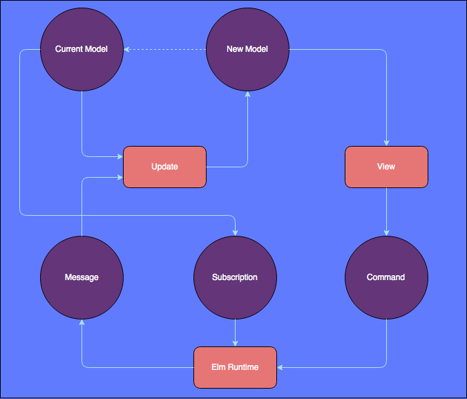
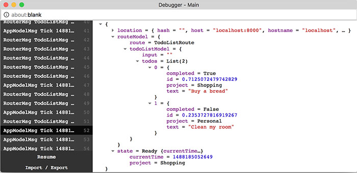
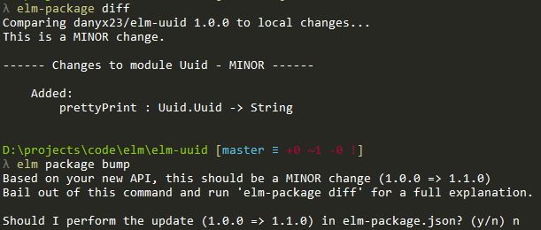
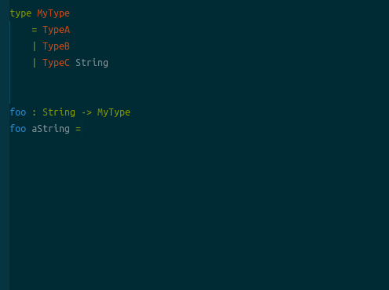
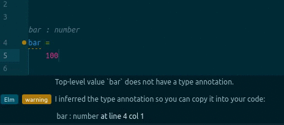

class: center, middle
background-image: url('images/backgrounds/elm-program.jpg')
background-size: cover
background-position: left

# Fearless Web Programming with Elm

by Arrizal Amin

---
background-image: url('images/backgrounds/js-and-elm-analogy.jpg')
background-size: cover
background-position: center

---

## Meet Elm

- Compiles to Javascript
- Strongly Typed
- Functional Programming
- Type Union instead of null/undefined
- Isolated from Javascript World

---

## Why Elm

- No Runtime Exception
- Blazing Fast (Compared to React, Angular 1 & 2, Ember)
- Enforced Semantic Versioning
- Javascript Interop via Port
- The Elm Architecture
- Friendly Error Message
- Time Travel Debugger
- elm-format

---
class: center, middle

# RIGBY

.center[]

---

## RIGBY

- Javascript is not a functional language
- Hard to refactor
- Hard to debug
- Need tons of dependencies just to get started
- Immutability is optional
- Unexpected API changes from third party will break the app
- Flowtype is optional
- "undefined is not a function"

---

## Installation

npm
```bash
$ npm i -g elm
```
macOS
```bash
$ brew install elm
```
Arch
```bash
$ yaourt -S elm-platform
```
Build from source
```markdown
https://github.com/elm-lang/elm-platform
```

---

## The Elm Architecture (TEA)

.center[]

---

## Model

Model represents the state of the app. Model can be anything, the most common one is using type alias. But there is a harder but better way to prevent impossible states with type union, watch: [Making Impossible States Impossible](https://www.youtube.com/watch?v=IcgmSRJHu_8).

```elm
type alias Model =
    { inputUsername : String
    , inputPassword : String
    , response : WebData (User)
    }
```
```elm
type Model
    = LoginPage String String
    | LoadingPage
    | Dashboard User
```

---

## Message

Message is a type union. It is provided to Update function to modify current model or trigger a command. Message can be created by DOM event, command, or subscription.

```elm
type Msg
    = InputUsername String
    | InputPassword String
    | SendRequest
    | HttpResponse (WebData User)
```

---

## Update

Update function will return a new model and command based on the message and current state.

```elm
update : Msg -> Model -> (Model, Cmd Msg)
update msg model =
    case msg of
        InputUsername input ->
            ( { model | username = input }, Cmd.none )
        InputPassword input ->
            ( { model | password = input }, Cmd.none )
        SendRequest ->
            let
                cmd =
                    sendLoginRequest model.username model.password
            in
                ( { model
                  | username = ""
                  , password = ""
                  , response = Loading
                  }
                , cmd )
        HttpResponse response ->
            ( { model | response = response }, Cmd.none )
```

---

## View

View is a function that returns an HTML as a Virtual DOM data based on current state and let elm runtime to render it.

```elm
view : Model -> Html Msg
view model =
    div []
        [ input [ value model.username
                , placeholder "username"
                , onInput InputUsername
                ]
                []
        , input [ value model.password
                , type_ "password"
                , placeholder "password"
                , onInput InputUsername
                ]
                []
        , button [ onClick SendRequest ] [ text "Login" ]
        ]
```

---

## Command

Command is a value that changes over time because it read/modify states outside of the app. Command executed in the elm runtime and returns a message with a result, this is how Elm manages side effects.

```elm
sendLogin : String -> String -> Cmd Msg
sendLogin username password =
    let
        body =
            Http.jsonBody <| requestBody username password
    in
        Http.post "https://backend/login" body userDecoder
            |> RemoteData.sendRequest
            |> Cmd.map HttpResponse

requestBody : String -> String -> Encode.Value
requestBody username password =
    Encode.object
        [ ( "username", Encode.string username )
        , ( "password", Encode.string password )
        ]
```

---

## Subscription

Subscription is how your application can listen to changes from external source (time, mouse, keyboard, etc).

```elm
subscription : Model -> Sub Msg
subscription model =
    case model.state of
        NotReady ->
            Sub.none

        Ready _ ->
            Time.every Time.second Tick
```

---

## Init

Init is a function that called before elm runtime started to render a view. This returns initial model and command.

```elm
init : (Model, Cmd Msg)
init =
    let
        model =
            Model "" "" NotAsked
    in
        ( model, Cmd.none )
```

---
class: center, middle
background-image: url('images/backgrounds/interop.png')
background-size: contain

# Javascript Interop

---

### Port

Even though elm executed in the isolated environment, elm and javascript can still communicate via a port. Port is the connecting pipe between Elm and JavaScript. Each port is only one direction.

```elm
port module Spelling exposing (..)

...

-- port for sending strings out to JavaScript
port check : String -> Cmd msg

-- port for listening for suggestions from JavaScript
port suggestions : (List String -> msg) -> Sub msg

...
```
```javascript
var app = Elm.Spelling.fullscreen();

app.ports.check.subscribe(function(word) {
    var suggestions = spellCheck(word);
    app.ports.suggestions.send(suggestions);
});

function spellCheck(word) {
    // have a real implementation!
    return [];
}
```

---

## Flag

```elm
type alias Flags =
  { user : String
  , token : String
  }

init : Flags -> ( Model, Cmd Msg )
init flags =
  ...

main =
  programWithFlags { init = init, ... }
```
```javascript
var app = Elm.MyApp.fullscreen({
    user: 'Tom',
    token: '12345'
});
```

---
class: center, middle

# Debugging in Elm

---

## Debug Module

Debug module included in the core package. This is mostly used for check the value on the function level. Debug has 2 functions

- `log : String -> a -> a`
- `crash : String -> a`

---

## Elm Time Travel Debugger

.center[]

---
class: center, middle

# Elm Tools

---

## Elm Tools

- elm-make (Bundled in elm-platform)
- elm-reactor (Bundled in elm-platform)
- elm-repl (Bundled in elm-platform)
- elm-package (Bundled in elm-platform)
- elm-format
- elm-css
- [elm-github-install](https://github.com/gdotdesign/elm-github-install)
- elmjutsu (Atom Package)
- Webpack

---

## elm-package

elm-package is the official package manager of Elm. Since elm-package enforces semver, we define dependency with minimum and maximum version of the package.

```json
{
    ...
    "dependencies": {
        "elm-lang/core": "5.1.1 <= v < 6.0.0",
        ...
    }
}
```

.center[]

---

## elm-format

elm-format formats Elm source code according to a standard set of rules. It makes code easier to write, read, maintain, and save time instead of argue over coding style since it is enforced by this tool.

## elm-jutsu




---

## Elm in the Future?

- Dead code elimination
- Server side Elm
- Run natively on mobile

---

## References

- [https://guide.elm-lang.org](https://guide.elm-lang.org)
- [https://www.elm-tutorial.org](https://www.elm-tutorial.org)

## Community

- [/r/elm](https://www.reddit.com/r/elm)
- [https://groups.google.com/forum/#!forum/elm-dev](https://groups.google.com/forum/#!forum/elm-dev)
- [https://elmlang.slack.com/](https://elmlang.slack.com/)
- [http://stackoverflow.com/questions/tagged/elm](http://stackoverflow.com/questions/tagged/elm)

## Examples

[https://github.com/arrizalamin/talks/tree/gh-pages/fearless-web-programming-with-elm/examples](https://github.com/arrizalamin/talks/tree/gh-pages/fearless-web-programming-with-elm/examples)

---
class: center, middle

# Thank You
